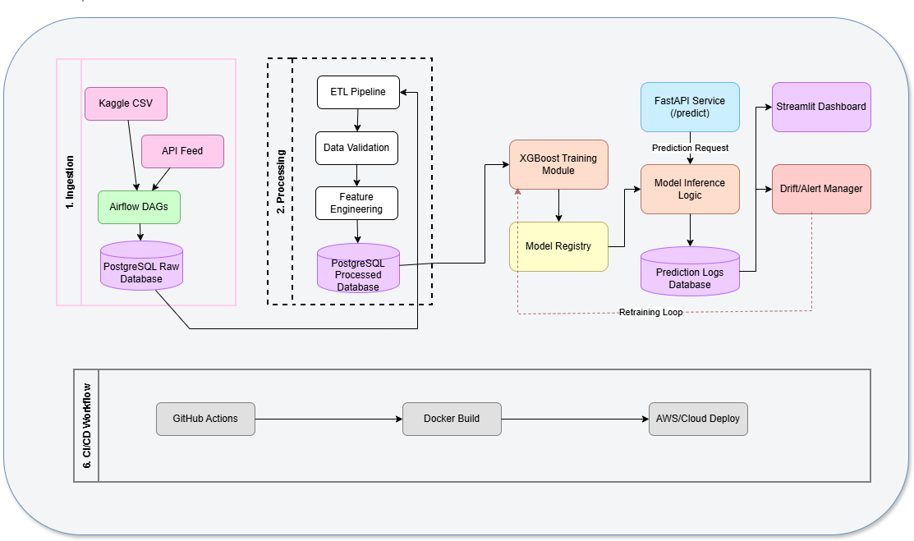

# 🛡️ Real-Time Fraud Detection in Digital Payments

> **A Production-Grade ML System** — End-to-end fraud scoring pipeline with real-time inference at < 200ms (p99) latency.

---

## 📌 Project Overview

Financial institutions lose over **$32 billion annually** to payment fraud. Traditional rule-based systems suffer from a > 15% false positive rate, creating friction for legitimate users while still missing sophisticated fraud patterns.

This project builds a **production-grade, end-to-end ML system** that:
- Ingests raw transaction data via Airflow DAGs
- Engineers meaningful features and trains an XGBoost classifier
- Serves predictions via a FastAPI endpoint in real-time
- Monitors model drift and triggers automated retraining

**Domain:** FinTech / Digital Payments  
**Timeline:** 4-Week Sprint  
**Current Stage:** 🟡 Week 1 — Data Foundation & Pipeline

---

## 🎯 Key Performance Indicators (KPIs)

| Metric | Target | Description |
|--------|--------|-------------|
| **Precision** | ≥ 0.85 | Minimize false fraud alerts |
| **Recall** | ≥ 0.90 | Capture most real fraud instances |
| **F1-Score** | ≥ 0.87 | Balanced accuracy |
| **Latency (p99)** | < 200ms | Real-time serving requirement |
| **System Uptime** | 99.9% | High availability |
| **Model Drift** | < 0.05 | PSI threshold for retraining |

---

## 🗂️ Dataset

**Source:** [Kaggle — Credit Card Fraud Detection](https://www.kaggle.com/datasets/mlg-ulb/creditcardfraud)

| Property | Detail |
|----------|--------|
| **File** | `creditcard.csv` (stored via Git LFS) |
| **Records** | 284,807 transactions |
| **Fraud Rate** | ~0.17% (highly imbalanced) |
| **Features** | 28 PCA-transformed features + `Amount`, `Time` |
| **Target** | `Class` — 0 (legitimate), 1 (fraud) |

> ⚠️ The dataset is highly imbalanced — a core ML challenge this project addresses using SMOTE and class-weighted training in Week 2.

---

## 🏗️ System Architecture



The system is divided into 6 layers:

| Layer | Components |
|-------|-----------|
| **1. Ingestion** | Kaggle CSV + API Feed → Airflow DAGs → PostgreSQL Raw DB |
| **2. Processing** | ETL Pipeline → Data Validation → Feature Engineering → PostgreSQL Processed DB |
| **3. Training** | XGBoost Training Module → Model Registry |
| **4. Serving** | FastAPI `/predict` → Model Inference Logic → Prediction Logs DB |
| **5. Observability** | Streamlit Dashboard + Drift/Alert Manager |
| **6. CI/CD** | GitHub Actions → Docker Build → AWS/Cloud Deploy |

---

## 🛠️ Tech Stack

| Category | Technology |
|----------|-----------|
| **Language** | Python 3.10+ |
| **ML Model** | XGBoost + Optuna (hyperparameter tuning) |
| **API** | FastAPI + Pydantic |
| **Database** | PostgreSQL |
| **Orchestration** | Apache Airflow |
| **Containerization** | Docker & Docker Compose |
| **Cloud** | AWS / GCP |
| **Monitoring** | Prometheus + Grafana |
| **CI/CD** | GitHub Actions |
| **Visualization** | Streamlit |
| **Version Control** | Git + Git LFS (for large datasets) |

---

## 📅 4-Week Execution Plan

### ✅ Week 1 — Data Foundation & Pipeline
| Day | Task | Status |
|-----|------|--------|
| Day 1–2 | Problem definition, KPI identification, dataset selection, architecture design | ✅ Done |
| Day 3–4 | Cloud environment setup, data ingestion to PostgreSQL | ⬜ Pending |
| Day 5 | Project structure setup, Git LFS tracking | ⬜ Pending |
| Day 6–7 | ETL scripts, data quality checks, initial EDA | ⬜ Pending |

### ⬜ Week 2 — Feature Engineering & Model Training
| Day | Task | Status |
|-----|------|--------|
| Day 1–2 | Feature engineering (SMOTE, class imbalance handling) | ⬜ Pending |
| Day 3–4 | Baseline model training + Optuna hyperparameter tuning | ⬜ Pending |
| Day 5 | Model evaluation — precision-recall curves | ⬜ Pending |
| Day 6–7 | Model serialization + training metadata tracking | ⬜ Pending |

### ⬜ Week 3 — Productionization & API Deployment
| Day | Task | Status |
|-----|------|--------|
| Day 1–2 | FastAPI development with Pydantic validation | ⬜ Pending |
| Day 3 | Prediction engine + caching | ⬜ Pending |
| Day 4–5 | Dockerization (Dockerfile + docker-compose) | ⬜ Pending |
| Day 6–7 | Cloud deployment + endpoint testing | ⬜ Pending |

### ⬜ Week 4 — Monitoring, CI/CD & Observability
| Day | Task | Status |
|-----|------|--------|
| Day 1–2 | CI/CD pipeline setup (GitHub Actions) | ⬜ Pending |
| Day 3 | Prometheus/Grafana monitoring + logging | ⬜ Pending |
| Day 4 | Load testing to verify latency KPIs | ⬜ Pending |
| Day 5 | Final documentation, README update, project demo | ⬜ Pending |

---

## 📁 Project Structure

> *Will be updated as the project evolves*

```
Real-Time-Fraud-Detection-in-Digital-Payments/
├── docs/
│   └── architecture.png        # System architecture diagram
├── creditcard.csv               # Dataset (tracked via Git LFS)
└── README.md
```

---

## 📈 Progress Log

| Date | Milestone |
|------|-----------|
| 2026-03-03 | Repo initialized, Git LFS configured for `creditcard.csv` |
| 2026-03-03 | Problem defined, KPIs set, dataset selected, architecture designed |

---

> 📝 *This README is updated incrementally as each week/day milestone is completed.*
